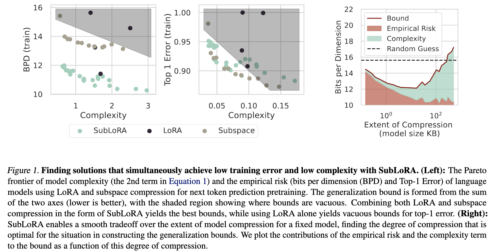

# Non-Vacuous Generalization Bounds for Large Language Models

[]() []()

This repository hosts the code for [Non-Vacuous Generalization Bounds for Large Language Models](https://arxiv.org/abs/2312.17173) by [Sanae Lotfi*](https://sanaelotfi.github.io), [Marc Finzi*](https://mfinzi.github.io), [Yilun Kuang*](https://yilunkuang.github.io/), [Tim G. J. Rudner](https://timrudner.com/), [Micah Goldblum](https://goldblum.github.io), and [Andrew Gordon Wilson](https://cims.nyu.edu/~andrewgw/). 


## Introduction

In this work, we address the question of generalization in LLMs by computing the first non-vacuous generalization bounds for language model pretraining on next token prediction, thereby providing a mathematical guarantee that LLMs are able to generalize beyond their training data. We make the following contributions: 
- **Novel bounds for the unbounded negative log-likelihood objective:** we introduce novel bounds specifically tailored to account for the unbounded continuous bits-per-dimension loss, commonly used to evaluate LLMs for next-token prediction.
- **Subsampling bounds for practical bound evaluation:** To make the evaluation of the bounds practical on LLMs with massive datasets, we derive subsampling-based bounds that allow for efficient evaluation. In practice, the evaluation of the bound takes 45 minutes on a single GPU instead of 3 days on 8 GPUs in parallel for the OpenWebText dataset.
- **SubLoRA: A simple yet powerful nonlinear subspace compression for LLMs:** We show that SubLoRA, a combination of LoRA and linear subspace training, yields a strong nonlinear compression of the model, which leads to the best generalization bounds for LLMs.
- **Non-vacuous generalization bounds for models with nearly a billion parameters:** our work does not only introduce the first non-vacuous generalization bounds for LLMs, but it also extends these bounds to models with over 800 million parameters, demonstrating the scalability of our compression technique. 
- **Improved understanding of generalization in LLMs:** as we increase the size of models, we find that they are able to find more compressed representations of the data and achieve better bounds, therefore disproving the claim that larger LLMs are simply better at regurgitating their training data. 

The significance of these contributions lies in the ability to offer mathematical proof that large language models are, in fact, powerful knowledge compressors and are capable of generalization beyond their training samples, especially as their scale increases.




Please cite our work if you find it helpful in your work:
```
@article{lotfi2023non,
  title={Non-vacuous generalization bounds for large language models},
  author={Lotfi, Sanae and Finzi, Marc and Kuang, Yilun and Rudner, Tim GJ and Goldblum, Micah and Wilson, Andrew Gordon},
  journal={arXiv preprint arXiv:2312.17173},
  year={2023}
}
```

## Setup

In order to create the environment with all the required packaged, you can run: 

```shell
conda env create -f environment.yml -n sublora
```

All of the code functions of our code are in the `sublora` folder, which we mark as a package. In order to install the `sublora` package, you should run: 

```shell
pip install -e .
```

## Experiments 

In order to reproduce our bound computation results for GPT2 models, you need to: 

1) Pretrain a GPT2 model from scratch with the SubLoRA parametrization. It is also possible to change the config in order to pretrain these models in a LoRA subspace, a linear subspace, or without subspace projection. 
2) Compute the bounds by loading the pretrained model, quantizing its weights with arithmetic coding, and using the quantized model to compute the subsampled empirical risk and the compressed model size, thereby obtaining the bound.  


### Pretraining GPT2 models with LoRA, Linear Subspace, and SubLoRA

To perform pretraining, we first need to download and preprocess the OpenWebText dataset (see more details in https://github.com/karpathy/nanoGPT/blob/master/README.md). You can get the dataset by running

```shell
python data/openwebtext/prepare.py
```

It is recommended to pretrain GPT2 with the SubLoRA parametrization using 4 GPUs in parallel. Also, this version of the code only supports multi-GPU training within a single node. 

In the case of a single GPU training, you can pretrain GPT2 models using the following command: 

```shell
python experiments/train.py --config-file=config/sublora_train.yaml
                            --data.dataset_dir=[PATH_TO_DATA]
                            --login.out_dir=[OUT-DIR_PATH]
```

If we have 4 GPUs within a single node, here is the command 

```shell
torchrun --standalone --nproc_per_node=4 experiments/train.py --config-file=config/sublora_train.yaml
                            --data.dataset_dir=[PATH_TO_DATA]
                            --login.out_dir=[OUT_DIR_PATH]
```

### Computing Generalization Bounds

Once we have the pretrained model checkpoint, we can perform quantization and the bounds computation with the following command

```shell
python experiments/eval_bounds.py --config-file=config/sublora_bounds.yaml
                                  --data.dataset_dir=[PATH_TO_DATA]
                                  --model.best_checkpoint_path=[PATH_TO_BEST_CKPT]
                                  --bounds.bound_type=document_level
                                  --data.openwebtext_train_eot_indices_file=[PATH_TO_EOT_INDICES]
                                  --data.empirical_document_length_distribution_file=[PATH_TO_DOC_LENGTHS]
```

### Finetuning Experiments

To obtain the finetuning generalization bounds on GLUE, we can run the following finetuning experiments: 

```shell
python run_glue_no_trainer.py   --model_name_or_path=gpt2
                                --task_name=TASK_NAME
                                --max_length=128
                                --pad_to_max_length=True
                                --per_device_train_batch_size=32
                                --learning_rate=2e-5
                                --num_train_epochs=5
                                --output_dir=[OUT_DIR_PATH]
                                --cache_dir=[PATH_TO_CACHE_DIR]
                                --intrinsic_dim=INTRINSIC_DIM
                                --load_pretrained_model=1
```

This script performs SubLoRA finetuning on one of the GLUE datasets. Notice that `intrinsic_dim` is the dimensionality of the subspace parametrization, `load_pretrained_model=0` means starting from a randomly initialized GPT-2 model while `load_pretrained_model=1` refers to starting from a pretrained standard GPT-2 checkpoint from huggingface. `task_name` should be one of the GLUE datasets. For the finetuning experiments, we are only considering `task_name` to be either `qqp` or `cola`. 

## LICENSE

Apache 2.0
